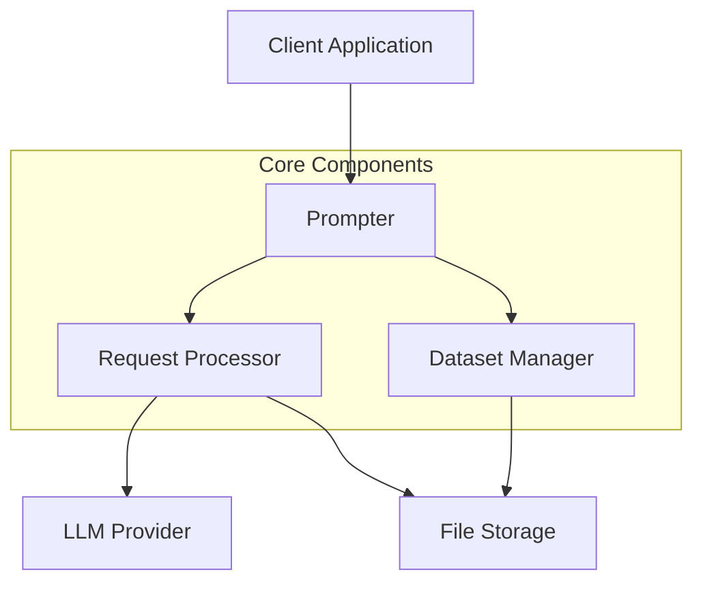
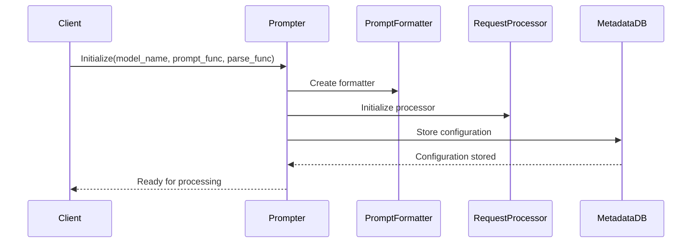
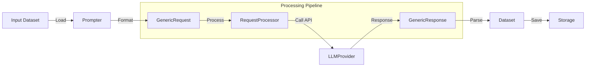
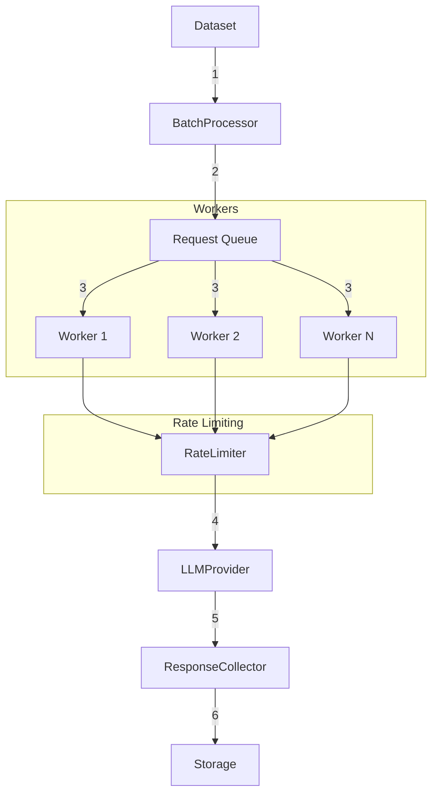
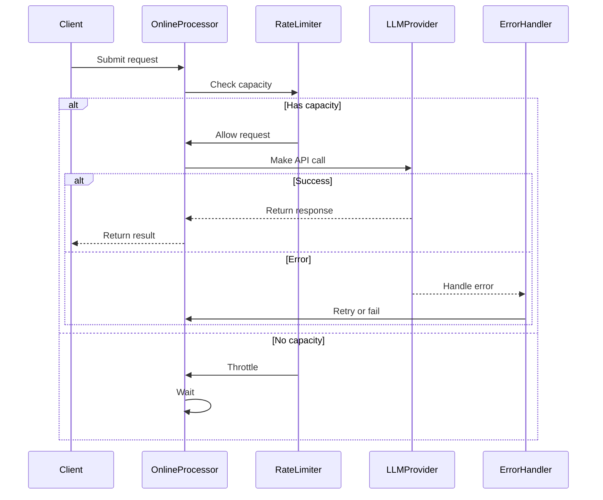
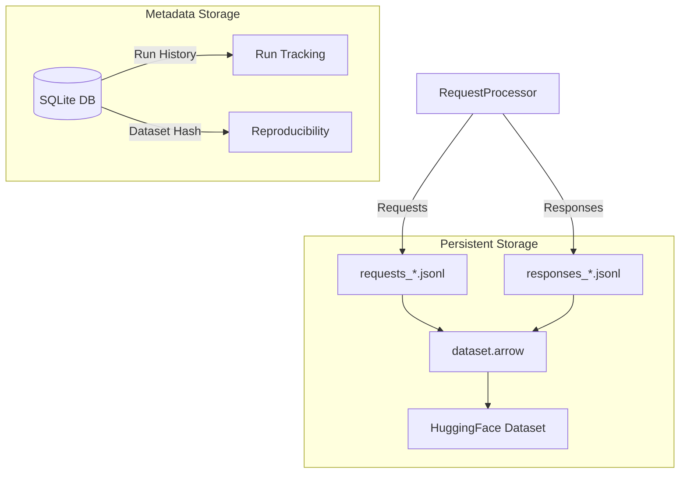
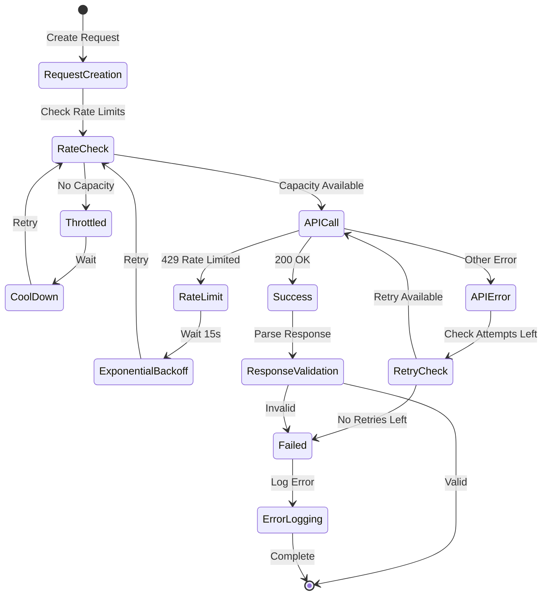
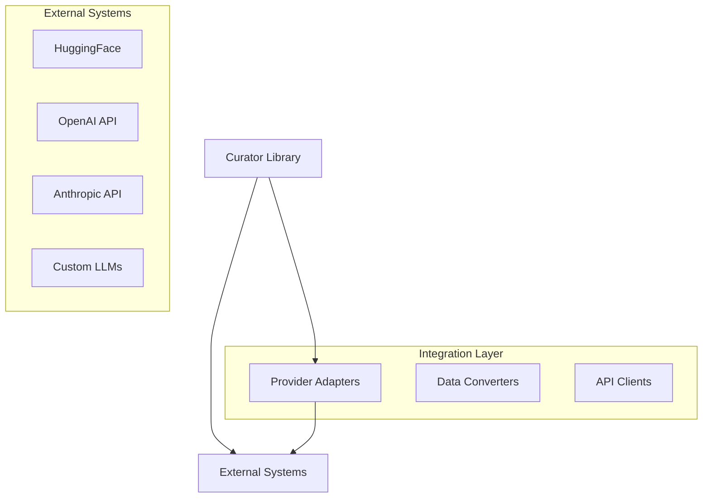

# Curator Component Interaction Documentation

## 1. High-Level System Architecture

**Description:**
The high-level architecture shows the main components of Curator:
- **Client Application**: Entry point for using Curator
- **Prompter**: Central orchestrator managing prompt formatting and processing
- **Request Processor**: Handles API interactions with LLM providers
- **Dataset Manager**: Manages data storage and retrieval
- **Storage**: Persistent storage for requests, responses, and processed data

## 2. Initialization and Configuration Flow

**Description:**
The initialization process involves:
1. Client configures Prompter with model and functions
2. Prompter creates PromptFormatter for structured prompts
3. RequestProcessor is initialized with rate limits
4. Configuration is stored in MetadataDB for tracking

## 3. Data Processing Pipeline

**Description:**
The data processing pipeline shows how data flows through the system:
1. Input data is loaded into Prompter
2. Prompter formats data into GenericRequests
3. RequestProcessor handles API communication
4. LLM Provider processes requests
5. Responses are converted to GenericResponses
6. Responses are parsed and validated
7. Results are saved to persistent storage

## 4. Batch Processing Architecture

**Description:**
The batch processing system:
1. Splits dataset into batches
2. Queues requests for processing
3. Distributes work across multiple workers
4. Enforces rate limits
5. Collects and validates responses
6. Stores results persistently

## 5. Online Processing Flow

**Description:**
Online processing handles real-time requests:
- Checks rate limits before processing
- Makes API calls when capacity is available
- Handles errors and retries
- Implements backoff strategies
- Returns results immediately

## 6. Storage Architecture

**Description:**
The storage system provides:
- JSONL files for raw requests/responses (split by batch)
- Arrow datasets for efficient data processing
- SQLite database for run metadata and reproducibility
- HuggingFace dataset integration
- Run history tracking

## 7. Error Handling and Recovery

**Description:**
The error handling system implements:
- Pre-request rate limit checking
- Automatic throttling when near limits
- Response validation and parsing
- Multiple retry attempts (configurable)
- Exponential backoff for rate limits
- Detailed error logging
- Batch and request tracking

## 8. Component Interaction Details

### Prompter
- Manages prompt formatting and validation
- Handles request routing (batch/online)
- Integrates with metadata storage
- Manages caching and state

### Request Processor
- Implements provider-specific API calls
- Handles rate limiting and quotas
- Manages request batching
- Implements retry logic
- Handles response validation

### Dataset Manager
- Provides dataset iteration
- Handles format conversion
- Manages persistent storage
- Implements caching
- Supports HuggingFace integration

### Metadata Database
- Tracks run history
- Stores configurations
- Manages cache keys
- Enables reproducibility
- Provides analytics data

## 9. Integration Points

**Description:**
Integration capabilities include:
- Multiple LLM provider support
- Dataset format conversion
- Custom provider integration
- External tool integration
- API compatibility layers